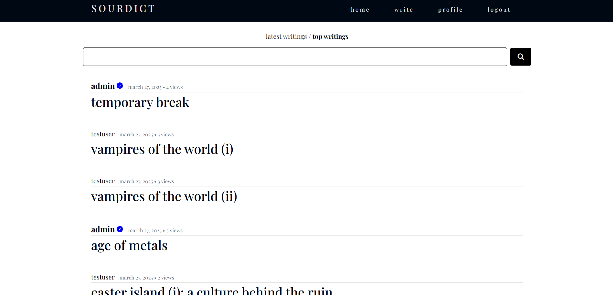

* Features

Dynamic article browsing and reading experience

Rich content editor for contributors

User authentication (register, login, logout)

Categorized posts for structured exploration

Search and filter capabilities

Clean and responsive design

Admin Panel

* Tech Stack

Backend: Django

Frontend: HTML5, CSS3, JavaScript

Database: SQLite/PostgreSQL

Deployment: Heroku

* Live Demo

Check out the live version here: https://sourdict-6da54861dd27.herokuapp.com
